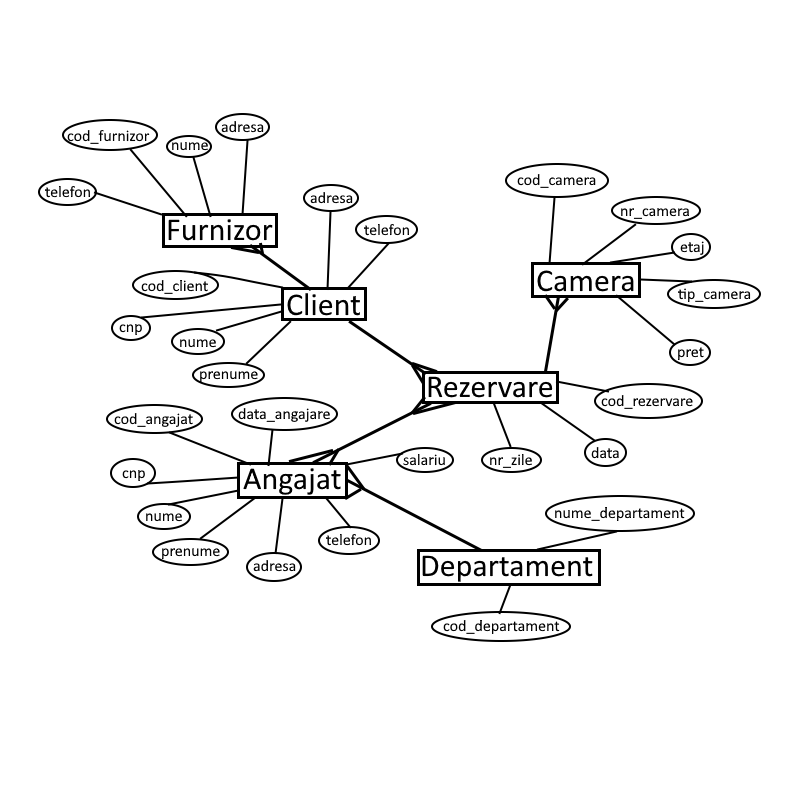
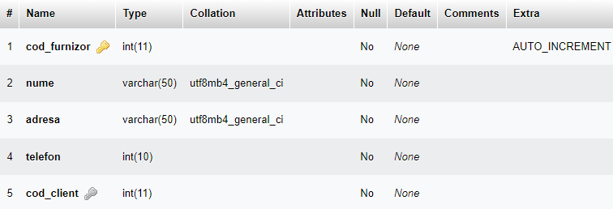
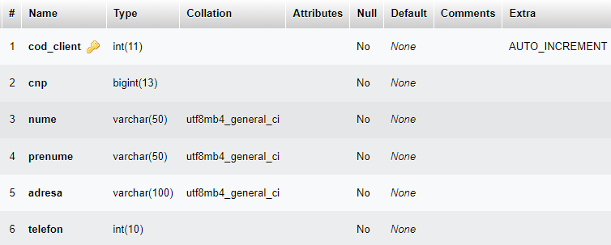
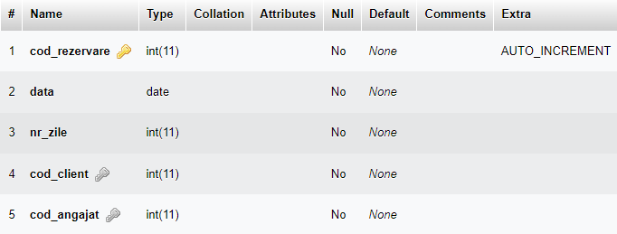
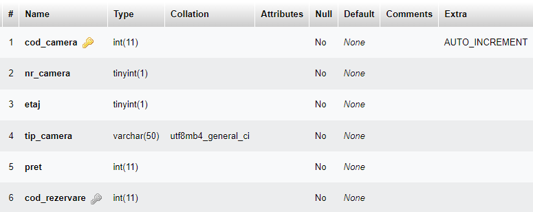
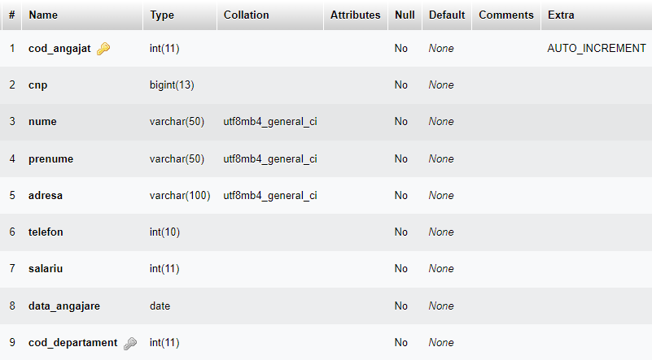
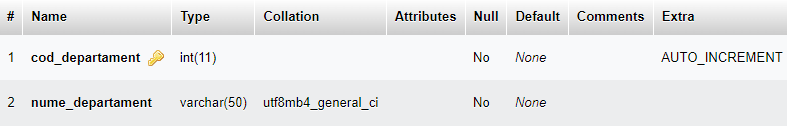
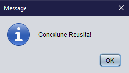
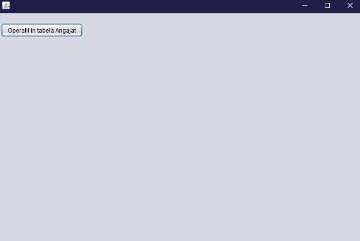
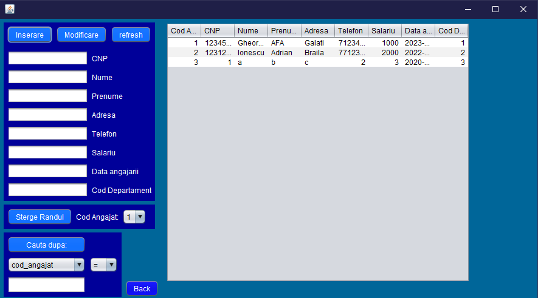

Proiect Baze de Date

\~Gestiunea unui Hotel\~

Coordonator,

Profesor Dan MUNTEANU

Student,

Chitiga Alexandru Gabriel

ANUL III CTI

GRUPA 22C32 A

AN 2022-2023

Proiect Baze de date

**Cuprins**

[1. Tema](#1-tema)

[2. Analiza problemei](#2-analiza-problemei)

[3. Specificarea cerintelor](#3-specificarea-cerintelor)

[4. Proiectarea la nivel conceptual: diagrame in toate relatiile](#4-proiectarea-la-nivel-conceptual-diagrame-in-toate-relatiile)

[5. Proiectarea la nivel logic: schema bazei de date relationale](#5-proiectarea-la-nivel-logic-schema-bazei-de-date-relationale)

[6. Proiectarea la nivel fizic: modelul fizic al datelor](#6-proiectarea-la-nivel-fizic-modelul-fizic-al-datelor)

[7. Tehnologii folosite:](#7-tehnologii-folosite)

[8. Functionalitate Aplicatie:](#8-functionalitate-aplicatie)

# 1. Tema

Gestiunea unui hotel

# 2. Analiza problemei

Indiferent de locul în care vă petreceți vacanța, aveți nevoie de un loc elegant și primitor unde să vă odihniți și să vă întoarceți împrospătat la muncă. Am ales acest subiect pentru a-i ajuta pe hotelieri și poate pentru a-i motiva pe hotelieri să documenteze mai bine ceea ce fac în hotelurile lor. În același timp, cred că sunt multe hoteluri care ar dori să beneficieze de programarea și definirea greșită a ceea ce au de făcut.

Clienții trebuie să poată face rezervări prin intermediul sistemului online. La momentul rezervării au trebuit să plătească în avans 10% din valoarea camerei și dacă nu se prezentau au renunțat la această plată în avans. Rezervările pot fi plătite cu un card de credit precum Visa sau MasterCard.

Atunci când sunt prezenți la hotel, clienții vor fi rugați să furnizeze informații despre identitatea lor, cum ar fi numele, CNP etc.

Camerele de hotel pot avea echipamente diferite. De exemplu, într-un hotel, sunt camere cu un televizor cu diagonala de 51 cm, și sunt camere cu televizor cu diagonala de 80 cm. Pe langa facilitatile camerei, clientii pot alege si se bucura de o serie de servicii suplimentare, contra cost bineinteles, precum folosirea sala de sport, piscina, tururi cu ghid de oras, room service, mic dejun, cina etc. cele mai bune conditii pentru clienti, managerul hotelului incearca sa satisfaca toate cerintele clientilor. Uneori se întâmplă ca un client să solicite un serviciu pe care hotelul nu îl poate oferi cu ajutorul personalului și al echipamentelor sale, precum plimbările cu snowmobilul. În acel moment, el este nevoit să apeleze la serviciile unui furnizor extern pentru a satisface clientul. La sfarsitul unui sejur la hotel, clientii au posibilitatea de a-si exprima opinia asupra calitatii serviciilor pe care le-au primit in timpul sejurului precum reclamatii sau laude.

# 3. Specificarea cerintelor

\-Introducerea, Vizualizarea, Modificarea, Filtrarea si cautarea datelor despre Angajati.

\-Introducerea, Vizualizarea Modificarea, Filtrarea si cautarea datelor despre Clienti.

\-Vizualizarea,Filtrarea si cautarea datelor despre Camere.

# 4. Proiectarea la nivel conceptual: diagrame in toate relatiile

# 5. Proiectarea la nivel logic: schema bazei de date relationale

furnizor[cod_furnizor, nume, adresa, telefon, cod_client];

client[cod_client, cnp, nume, prenume, adresa, telefon];

rezervare[cod_rezervare, cod_client, cod_angajat, data, nr_zile];

camera[cod_camera, nr_camera, etaj, tip_camera, pret, cod_rezervare];

angajat[cod_angajat, cnp, nume, prenume, adresa, telefon, salariu, data_angajare, cod_departament];

departament[cod_departament, nume_departament];

# 6. Proiectarea la nivel fizic: modelul fizic al datelor

FURNIZOR:

CLIENT:

REZERVARE:

CAMERA:

ANGAJAT:

DEPARTAMENT:

# 7. Tehnologii folosite:

-   Java
-   SQL
-   Apache POI
-   driver JDBC
-   XAMPP

**Java** este un limbaj de programare orientat-obiect, puternic tipizat, conceput de către James Gosling la Sun Microsystems (acum filială Oracle) la începutul anilor ʼ90, fiind lansat în 1995. Cele mai multe aplicații distribuite sunt scrise în Java, iar noile evoluții tehnologice permit utilizarea sa și pe dispozitive mobile, spre exemplu telefon, agenda electronică, palmtop etc. În felul acesta se creează o platformă unică, la nivelul programatorului, deasupra unui mediu eterogen extrem de diversificat. Acesta este utilizat în prezent cu succes și pentru programarea aplicațiilor destinate intranet-urilor.

**SQL** este un limbaj de programare specific pentru manipularea datelor în sistemele de manipulare a bazelor de date relaționale (RDBMS), iar la origine este un limbaj bazat pe algebra relațională. Acesta are ca scop inserarea datelor, interogații, actualizare și ștergere, modificarea și crearea schemelor, precum și controlul accesului la date.

**Apache POI** , un proiect condus de Apache Software Foundation și anterior un sub-proiect al Proiectului Jakarta , oferă biblioteci Java pure pentru citirea și scrierea fișierelor în formate Microsoft Office , cum ar fi Word , PowerPoint și Excel .

**Un driver JDBC** este o componentă software care permite unei aplicații Java să interacționeze cu o bază de date drivere JDBC sunt similare cu drivere ODBC , furnizori de date ADO.NET , și furnizorii de OLE DB . Pentru a vă conecta la baze de date individuale, JDBC (Java Database Connectivity API ) necesită drivere pentru fiecare bază de date. Driverul JDBC oferă conexiunea la baza de date și implementează protocolul pentru transferul interogării și rezultatului între client și bază de date.

**XAMPP** este un pachet de programe free software, open source și cross-platform web server, care constă în Apache HTTP Server, MySQL database și interpretoare pentru scripturile scrise în limbajele de programare PHP și Perl. Noi folosim aplicatia XAMPP pentru a accesa o baza de date locala MySQL pe care o manageriem folosind phpMyAdmin.

# 8. Functionalitate Aplicatie:

Fereastra de confirmare a conexiunii:

Meniu principal:

Panou de control pentru tabela Angajat:

